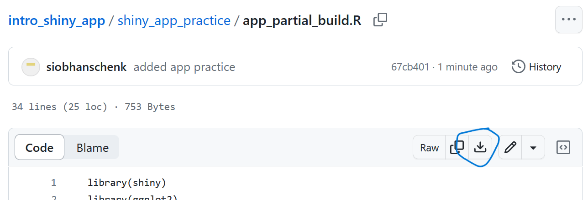
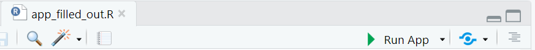
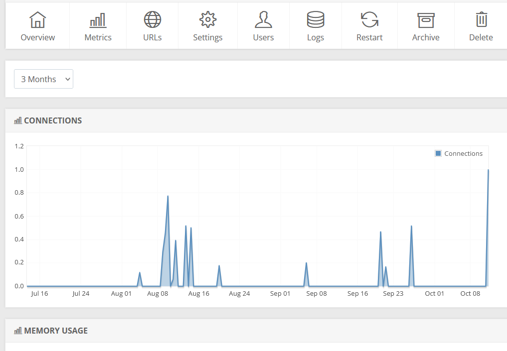

### Build your own app

Got to the library GitHub to download:

a) template script that we will work on together <https://github.com/ubc-library-rc/intro_shiny_app/blob/main/shiny_app_practice/app_partial_build.R>

b) a script that is filled out already (we are building to this) <https://github.com/ubc-library-rc/intro_shiny_app/blob/main/shiny_app_practice/app_filled_out.R>

{width="291"}

### After building your app...

Don't forget to test your app with `run app` and publish the app with the blue `publish` button! Publishing take a bit of time (\~30 min) depending on the size of the app and the data set being uploaded along with the app build.

**Note**. Posit hosts Shiny apps and that is where you will be publish your app. You can make a Posit account or use your Google, GitHub, or Clever account. We recommend logging in with GitHub!

Posit also provides basic app analytics, so you can see how popular your app is.

{width="347"}
