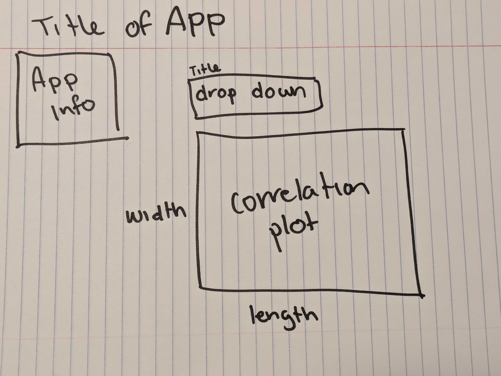
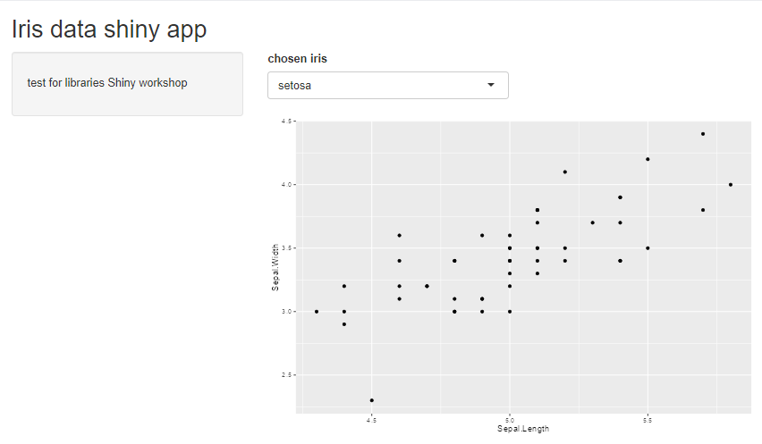

# Build your own app

### Tips

Have a clear goal in mind!

Work on one part at a time (alternate between ui and server when needed) and see if the app runs before moving to the next section.

Drawing the app layout (see below) really helps with code organization and remembering what parts are important to you. This is a simple example, but with more complex apps, you could start adding more information to the drawing including, what the parts are called (e.g. corrplot in the example we will build today).

{width="346"}

## Example app practice

See how this app has the same layout as the drawing above?

Go to the library GitHub to download:

a)  template script that we will work on together <https://github.com/ubc-library-rc/intro_shiny_app/blob/main/shiny_app_practice/app_partial_build.R>

b)  a script that is filled out already (we are building to this) <https://github.com/ubc-library-rc/intro_shiny_app/blob/main/shiny_app_practice/app_filled_out.R>

## After building your app...

Don't forget to test your app with `run app` and publish the app with the blue `publish` button! Publishing take a bit of time (\~30 min) depending on the size of the app and the data set being uploaded along with the app build. 

**Note**. Posit hosts Shiny apps and that is where you will be publish your app. You can make a Posit account or use your Google, GitHub, or Clever account. We recommend logging in with GitHub!

Posit also provides basic app analytics, so you can see how popular your app is.

