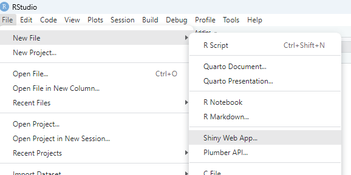
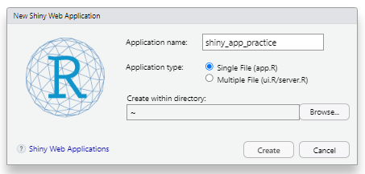
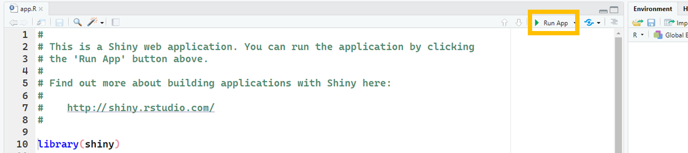
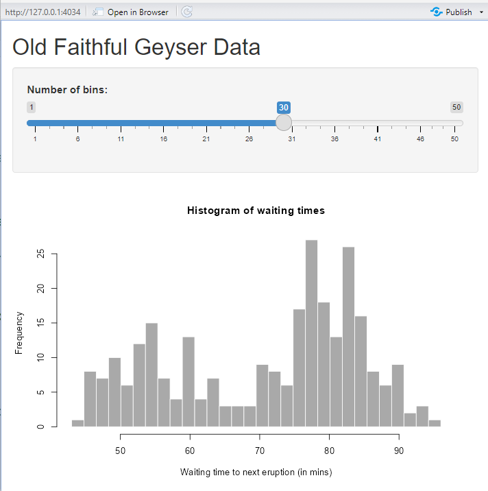
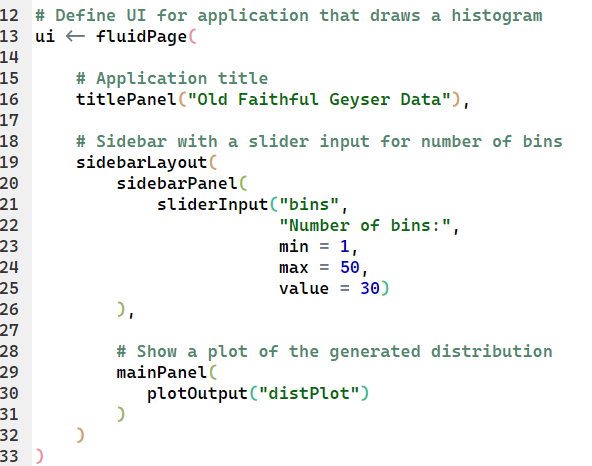
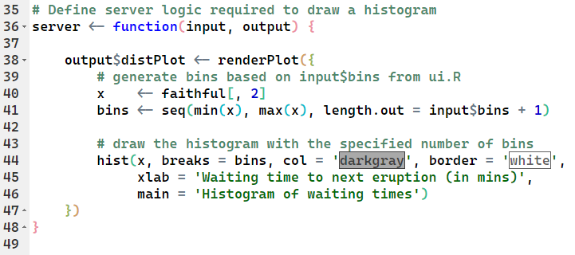

### How to Open the Shiny Web App Script

1.  In RStudio, click *File \> New File \> Shiny Web App*

2.  Once you're selected to create a new Shiny app, this window will pop up, prompting you to name the app. Choose a descriptive name if possible, then click *Create*.

3.  After creating the new app, the script on the left will be pre-loaded. This is a chance for you to look at the structure of Shiny app and play around with one. To run the pre-loaded app, click the *Run App* button.

4.  Now that you have ran the app, you should see the Shiny app in a new window.

### Parts of the Shiny App

Shiny apps have two parts. The `ui` (user interface) and the `server` (the computing behind the scenes).

Have a look at the pre-loaded app code. The code has distinct parts.

1.  Loads the Shiny app with `library(Shiny)` to tell R that we are making a Shiny app.

2.  Has the `ui` and `Server` sections of the app.

3.  At the end, the `shinyApp(ui = ui , server = server)` is what allows you to run the app.

### Parts of the ui

In the pre-loaded example, the ui is a `fluidPage` type. Within the `fluidPage`, we have three sections: the `titlePannel`, the `sidebar`, and the `mainPannel`.

If we look to the example app, we see that the `titlePannel` is what generates the title of the app.

The `sidebar` contains multiple sections:

-   The `Number of bins` text is the title of the slider in the app.

-   The `min, max,` and `value` arguments are the default values that get pre-loaded into the app when it is run.

-   The remaining argument, bins is what allows the app to be interactive. Find bins in the server section of the app!

The `mainPannel` contains a single section, `plotOutput`. This tell the Shiny app to plot the output of the `distPlot` (the histogram in the app), which is generated in the server.

### Parts of the server

The first thing to notice in the server is that it is built as a function

`server <- function(input, output) { }`

-   The input is the user input of sliding the slider to select a number of bins.

    -   You can figure this out by looking at the `bins <- seq(min(x), max(x), length.out = input$bins + 1)` line in the server. This line sets the number of `bins` for the `distPlot`.

-   The output is the plot, `distPlot.` Both of these elements (`bins` and `distPlot`) are in the `ui`. This is how the function `server` connects to the `ui`.
