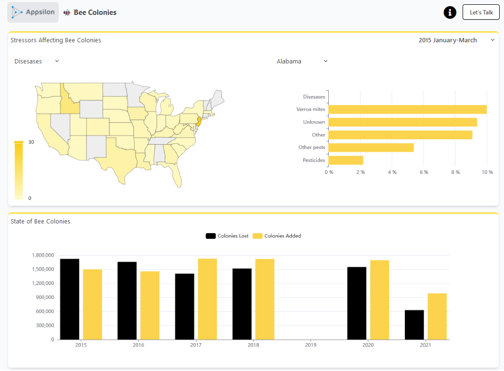

### Contexts where building an app would be useful 

1.   Data are ready to be public.

2.   End users of the data will want to see many/different graphs.

3.  Linking multiple other resources to your data.

### What are Shiny apps not good at

1.  Initial data exploration and cleaning

    -   Not good to look through raw data.

    -   Poorly formatted data will create errors in the Shiny app itself.

2.  Any pre-publication data analysis.

3.  Being found online! Posit (Shiny) <u>does not index</u> the apps themselves. Promote your app using other strategies!

### Example app (Bees)

<https://connect.appsilon.com/bee-colony/>

This app has 3 different graphs that changed based on user input from three different drop down menus.

They link to information about the bee project, the USDA website, and a contact form (top right). Also, at the top left, there is a link to Appsilon, who are the people who made the app.
